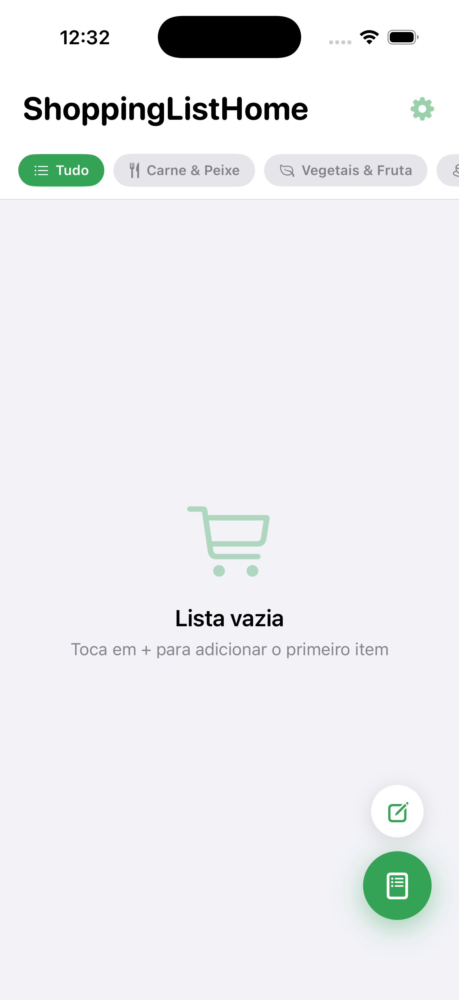

# ShoppingListHome

A simple, free shopping list app for iOS, built with SwiftUI and SwiftData.

No sign-up, no accounts, no server — open the app and start adding items to your list.
Everything is stored locally on your device.

## Features

- Add items manually or pick them from a built-in product catalog (grouped by category)
- Categorize items (meat & fish, vegetables & fruit, dairy, bakery, cleaning, hygiene, drinks,
  snacks, and more)
- Track quantity and unit per item
- Check items off as you shop, clear the cart in one tap
- Light / dark / system appearance
- Portuguese and English localization
- 100% offline, on-device storage (SwiftData) — no account, no internet connection required

## Requirements

- Xcode 15 or later
- iOS 17 or later (deployment target configured in the project)

## Getting started

1. Clone the repository
2. Open `ShoppingListHome.xcodeproj` in Xcode
3. Select your own signing team under **Signing & Capabilities** (the project ships with
   automatic signing and no team configured)
4. Build and run on a simulator or device

There is no backend to configure — the app works immediately.

## Live demo

A TestFlight link will be added here once available.

## License

MIT — see [LICENSE](LICENSE).
